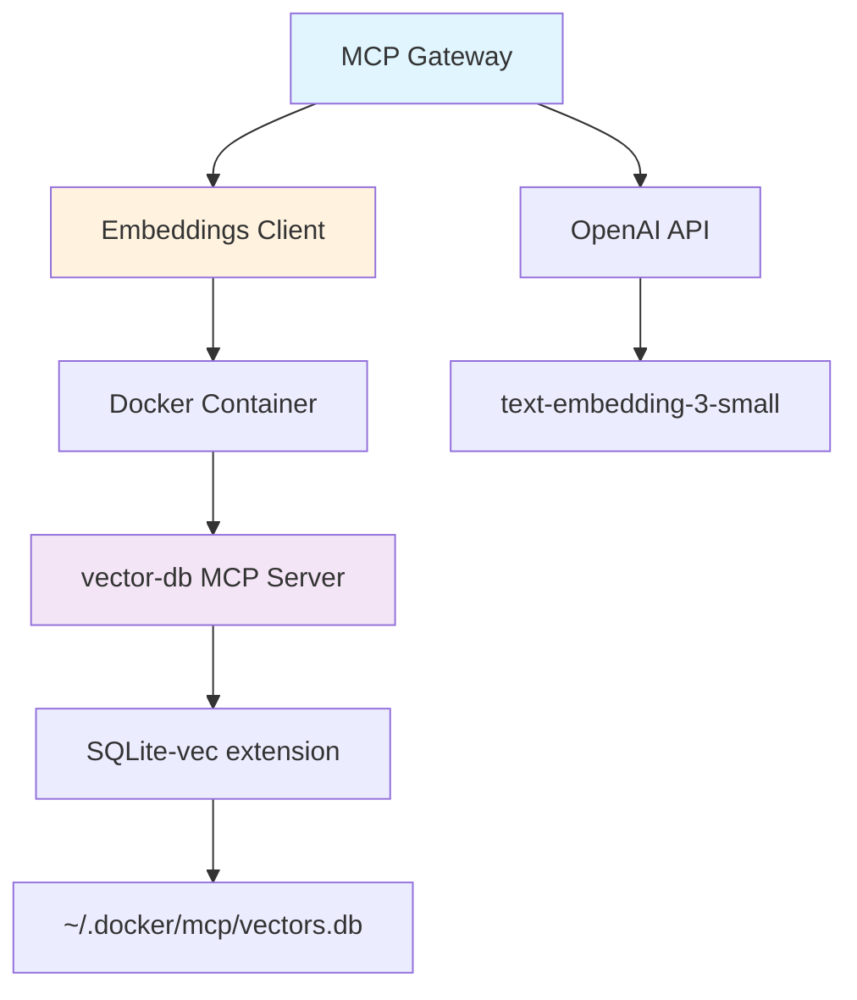
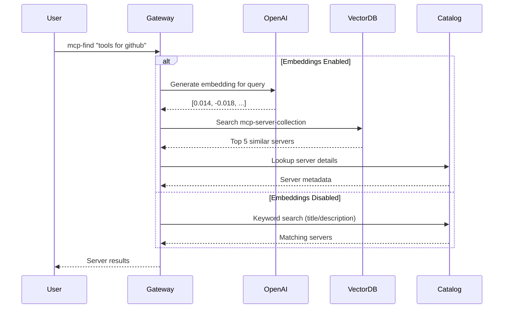
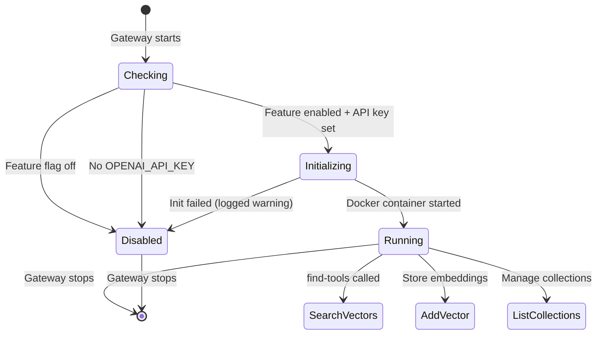

# Vector Embeddings for MCP Gateway

**Semantic Search for MCP Servers and Tools**

---

## Overview

Added AI-powered semantic search capabilities to the MCP Gateway using OpenAI embeddings and SQLite vector database.

**Key Features:**
- Vector similarity search for finding relevant MCP servers
- Feature flag system for opt-in usage
- Graceful fallback to keyword search

---

## Components



---

## Feature Flag System

```bash
# Enable embeddings feature
docker mcp feature enable use-embeddings

# Set OpenAI API key
export OPENAI_API_KEY="sk-..."
```

**Configuration:**
- Feature: `use-embeddings` (disabled by default)
- Storage: `~/.docker/mcp/vectors.db`
- Model: OpenAI `text-embedding-3-small` (1536 dimensions)

---

## How mcp-find Works with Embeddings



---

## Implementation: VectorDBClient

```go
type VectorDBClient struct {
    cmd     *exec.Cmd
    client  *mcp.Client
    session *mcp.ClientSession
}

// Connects to Docker container running vector-db
func NewVectorDBClient(ctx context.Context, dataDir string) (*VectorDBClient, error) {
    cmd := exec.CommandContext(ctx,
        "docker", "run", "-i", "--rm",
        "-v", fmt.Sprintf("%s:/data", dataDir),
        "-e", "DB_PATH=/data/vectors.db",
        "-e", "VECTOR_DIMENSION=1536",
        "jimclark106/vector-db:latest",
    )
    // ... MCP client setup with CommandTransport
}
```

---

## Key Operations

```go
type SearchArgs struct {
    Vector             []float64 `json:"vector"`
    CollectionName     string    `json:"collection_name,omitempty"`
    ExcludeCollections []string  `json:"exclude_collections,omitempty"`
    Limit              int       `json:"limit,omitempty"`
}

func (c *VectorDBClient) SearchVectors(
    ctx context.Context,
    vector []float64,
    options *SearchOptions,
) ([]SearchResult, error)
```
**Collections:**
- `Tool embeddings`: one vector collection/server
- `mcp-server-collection`: MCP server metadata

---

## Updated Tools

### mcp-find Tool
- **With Embeddings:** Semantic search against `mcp-server-collection`
- **Without Embeddings:** Traditional keyword matching
- Returns: Server name, description, secrets, config schema

### find-tools Tool
- **With Embeddings:** AI-powered server recommendations
- **Without Embeddings:** Error message with guidance
- Input: Natural language task description
- Output: Relevant servers from catalog

---

## Code Structure

```
pkg/gateway/
├── embeddings/
│   └── client.go          # VectorDBClient implementation
├── findmcps.go            # findServersByEmbedding()
├── findtools.go           # generateEmbedding() + find-tools tool
└── dynamic_mcps.go        # mcp-find tool + decodeArguments()

cmd/docker-mcp/commands/
├── feature.go             # use-embeddings feature flag
└── gateway.go             # Feature check + client init
```

---

## Embeddings Client Lifecycle



---

## Data Flow: Semantic Search


---

## Benefits

✅ **Natural Language Search**
- "tools for github" → github server
- "database queries" → sqlite server

✅ **Better Discovery**
- Semantic matching vs exact keywords
- Handles synonyms and related concepts

✅ **Graceful Degradation**
- Falls back to keyword search if unavailable
- Gateway continues working without embeddings

✅ **Opt-in Feature**
- Disabled by default
- Requires explicit enablement + API key

---

## Testing & Validation

**Build:**
```bash
make docker-mcp
make lint
```

**Enable Feature:**
```bash
docker mcp feature enable use-embeddings
export OPENAI_API_KEY="sk-..."
docker mcp gateway run
```

**Test Search:**
```bash
# Via Claude Desktop or other MCP client
Find mcp tools that can help me ...
```

---

## Implementation Details

**Files Created:**
- `pkg/gateway/embeddings/client.go` (318 lines)
- `pkg/gateway/findmcps.go` (83 lines)

**Files Modified:**
- `pkg/gateway/dynamic_mcps.go` - Base64 decoding + mcp-find handler
- `pkg/gateway/findtools.go` - Embedding generation
- `pkg/gateway/run.go` - Client initialization
- `pkg/gateway/config.go` - UseEmbeddings flag
- `cmd/docker-mcp/commands/feature.go` - Feature registration
- `cmd/docker-mcp/commands/gateway.go` - Feature check

---

## Future Enhancements

🔮 **Possible Improvements:**
- distribute embeddings with catalogs
- Support other embedding models and providers
- Automatic reindexing on catalog changes

---

## Summary

✨ **What We Built:**
- sqlite-vec integration
- LLM embeddings integration
- Semantic search for MCP servers

🎯 **Impact:**
- Better server/tool discovery
- Natural language queries
- Foundation for AI-powered gateway

---

## Questions?

**Documentation:**
- Feature flags: `docker mcp feature ls`
- sqlite-vec service image: `jimclark106/vector-db:latest`
- model: `text-embedding-3-small`

**Storage:**
- `~/.docker/mcp/vectors.db`
- `~/.docker/config.json` (feature flags)

**Code:**
- Branch: `slim/embeddings`
- Main files: `pkg/gateway/embeddings/`, `findmcps.go`
